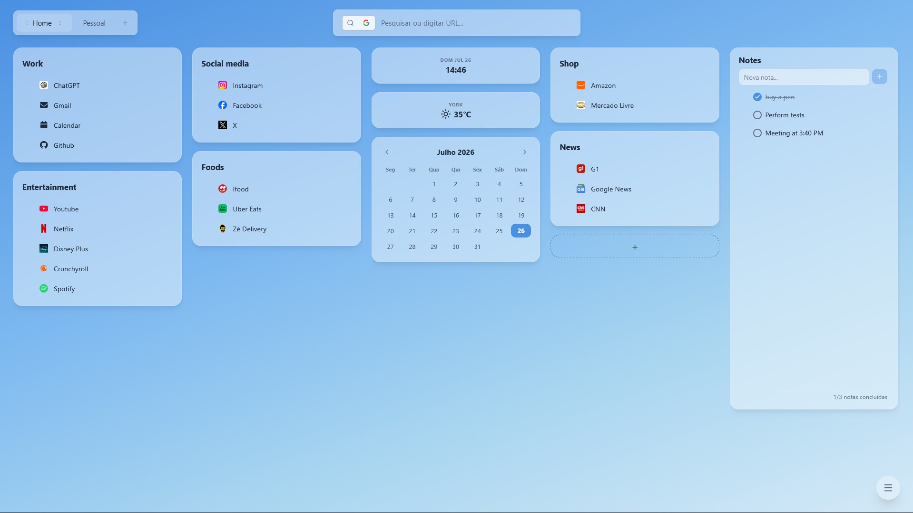

  

<h1 align="center">Prismi</h1>

  <b>Your new tab, finally useful.</b>
   
  Save any tab, link, or note in one click, then find it instantly, right on your new tab.

  
  

---

## Stop losing tabs you meant to come back to

Prismi turns the most familiar page in your browser into a small system for the things you want to return to. Save a useful page instead of leaving another tab open as a reminder, give it a home in seconds, and pick up exactly where you left off.

Your collection is waiting in every new tab, ready when the next task starts.

  

## A calmer starting point

**Save what is worth keeping** - Save tabs, links, and notes while they are still useful, without keeping them open as reminders.

**Give every context a home** - Create boards for work, ideas, reading, or anything else that helps you think clearly.

**Find the thread again** - Your saved collection is always available on your new tab, so you can return to the right link when the next task begins.

**Make the space yours** - Choose a wallpaper, tune the colors, and add the small utilities that make a new tab useful from the first click.

**Search without leaving** - Find saved links or use the built-in search bar from the place where your next task begins.

**Import bookmarks** - Bring existing browser bookmarks into Prismi, keep the useful ones, and organize the rest.

## How it works

| Step | What to do |
|---|---|
| **1. Install** | Add Prismi from Firefox Add-ons or the Chrome Web Store. It becomes your new-tab page. |
| **2. Create a board** | Start with a context you return to, such as a project, reading list, or everyday tools. |
| **3. Save and return** | Save useful tabs, links, or notes in one click and find them again whenever you open a new tab. |

## Compatibility

Prismi works on desktop Firefox, Chrome, Edge, Opera, Brave, and most Chromium-based browsers. Mobile browsers are not supported.

## Privacy

Prismi is free and private by design: no ads, tracking, subscriptions, or feature caps. Your saved links remain under your control, are stored locally in your browser, and can be exported.

Read the full [Privacy Policy](PRIVACY.md).

## Support the project

  

Prismi is free and open source. If you find it useful, a star on GitHub helps other people discover the project.

  
  &nbsp;&nbsp;
  

  <b><a href="https://github.com/joaokogs/prismi">Star the repository on GitHub</a></b>
   
  Open source. No ads or tracking. Your saved links stay under your control.

  

## License

MIT
